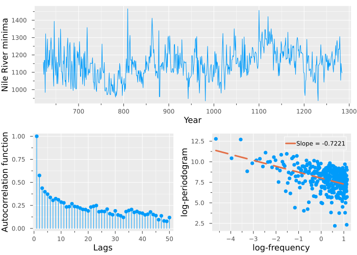

# Summary

Long memory in time series analysis deals with the notion that data may have a strong dependence on past values. @Hurst1956 is one of the pioneering works on long memory. The author analyzed the flow of the Nile River and noted that water reservoirs that do not account for its long-term dynamics are at risk of overflowing. Long memory models are used in climate, finance, biology, economics, and many other fields.

We say that a time series $x_t$ has long memory if:
$$\gamma_x(k) \approx C_x k^{2d-1}\quad \textnormal{as}\quad k\to\infty, \label{def:cov}$$
where $\gamma_x(k)$ is the autocovariance function and $C_x$ a constant, or if:
$$f_x(\lambda)\approx C_f\lambda^{-2d}\quad \textnormal{as}\quad \lambda\to 0, \label{def:spectral}$$
where $f_x(\lambda)$ is the spectral density function and $C_f$ is a constant. Above, $g(x)\approx h(x)$ as $x\to x_0$ means that $g(x)/h(x)$ converges to $1$ as $x$ tends to $x_0$.

Properties (\autoref{def:cov}) and (\autoref{def:spectral}) can be analyzed graphically by plotting the autocorrelation and periodogram (an estimator of the spectral density), respectively.

As an example, the figure below shows the autocorrelation and periodogram (in logs) for the Nile River minima data. The data are available in `LongMemory.jl` through `NileData`.

As the figure shows, the autocorrelation function decays slowly and the periodogram diverges towards infinity near the origin. These are the features of long memory processes described in (\ref{def:cov}) and (\ref{def:spectral}), respectively. The `LongMemory.jl` package is concerned with methods for modeling data with this type of behavior.

# Statement of need

`LongMemory.jl` is a package for time series long memory modeling in Julia [@juliaprimer]. The package provides functions to generate long memory, estimate model parameters, and forecast. Generating methods include fractional differencing, stochastic error duration, and cross-sectional aggregation. Estimators include the classic ones used to estimate the Hurst effect, those inspired by log-periodogram regression, and parametric ones. Forecasting is provided for all parametric estimators. Moreover, the package adds plotting capabilities to illustrate long memory dynamics and forecasting. For some of the theoretical developments, `LongMemory.jl` provides the first publicly available implementation in any programming language. A notable feature of this package is that all functions are implemented in the same programming language, taking advantage of the ease of use and speed provided by Julia. Therefore, all code is accessible to the user. Multiple dispatch, a novel feature of the language, is used to speed computations and provide consistent calls to related methods. The package is related to the R [@R:lang] packages `LongMemoryTS` [@R:LongMemoryTS] and `fracdiff` [@R:fracdiff].

# Examples of Research Conducted with `LongMemory.jl`

The package has been used in the following research:

- Vera-Valdés, J. Eduardo, and Olivia Kvist. 2024. “Breaching 1.5°C: Give Me the Odds.” arXiv, December. https://doi.org/10.48550/arXiv.2412.13855. [@vera-valdés2024]

- Vera-Valdés, J.E., and Kvist, O. (2024). “Effects of the Paris Agreement and the COVID-19 Pandemic on Volatility Persistence of Stocks Associated with the Climate Crisis: A Multiverse Analysis.” [@VERAVALDES2024c]

# References